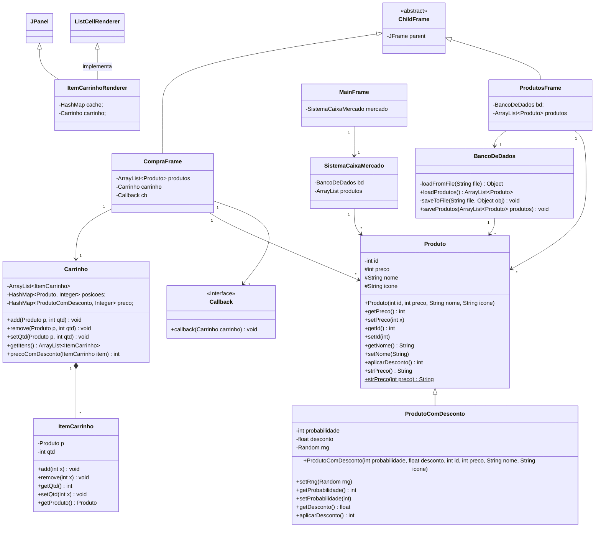

# TP1

# Diagrama de classes

```mermaid
classDiagram

class SistemaCaixaMercado {
    -BancoDeDados bd
    -ArrayList<Produto> produtos
}

SistemaCaixaMercado "1" --> "*" Produto

class BancoDeDados {
    -loadFromFile(String file) Object
    +loadProdutos() ArrayList~Produto~

    -saveToFile(String file, Object obj) void
    +saveProdutos(ArrayList~Produto~ produtos) void
}
BancoDeDados "1" --> "*" Produto

class Produto {
    -int id
    #int preco
    #String nome
    #String icone
    +Produto(int id, int preco, String nome, String icone)
    +getPreco() int
    +setPreco(int x)
    +getId() int
    +setId(int)
    +getNome() String
    +setNome(String)
    +aplicarDesconto() int
    +strPreco() String
    +strPreco(int preco)$ String
}

class ProdutoComDesconto {
    -int probabilidade
    -float desconto
    -Random rng
    +ProdutoComDesconto(int probabilidade, float desconto, int id, int preco, String nome, String icone)
    +setRng(Random rng)
    +getProbabilidade() int
    +setProbabilidade(int)
    +getDesconto() float
    +aplicarDesconto() int
}

Produto <|-- ProdutoComDesconto

class ItemCarrinho {
    -Produto p
    -int qtd

    +add(int x) void
    +remove(int x) void
    +getQtd() int
    +setQtd(int x) void
    +getProduto() Produto
}

class Carrinho {
    -ArrayList~ItemCarrinho~
    -HashMap~Produto, Integer~ posicoes;
    -HashMap~ProdutoComDesconto, Integer~ preco;

    +add(Produto p, int qtd) void
    +remove(Produto p, int qtd) void
    +setQtd(Produto p, int qtd) void
    +getItens() ArrayList~ItemCarrinho~
    +precoComDesconto(ItemCarrinho item) int
}

Carrinho "1" *-- "*" ItemCarrinho

class ChildFrame {
    <<abstract>>
    -JFrame parent
}

class Callback {
    <<Interface>>
    +callback(Carrinho carrinho) void
}

class ItemCarrinhoRenderer {
    -HashMap<String, ImageIcon> cache;
    -Carrinho carrinho;
}

JPanel <|-- ItemCarrinhoRenderer
ListCellRenderer <|-- ItemCarrinhoRenderer : implementa

class CompraFrame {
    -ArrayList~Produto~ produtos
    -Carrinho carrinho
    -Callback cb
}

ChildFrame <|-- CompraFrame
CompraFrame "1" --> "1" Carrinho
CompraFrame "1" --> "*" Produto
CompraFrame "1" --> "1" Callback

class ProdutosFrame {
    -BancoDeDados bd;
    -ArrayList~Produto~ produtos
}

ChildFrame <|-- ProdutosFrame
ProdutosFrame "1" --> "1" BancoDeDados
ProdutosFrame "1" --> "*" Produto

class MainFrame {
    -SistemaCaixaMercado mercado
}

MainFrame "1" --> "1" SistemaCaixaMercado

```