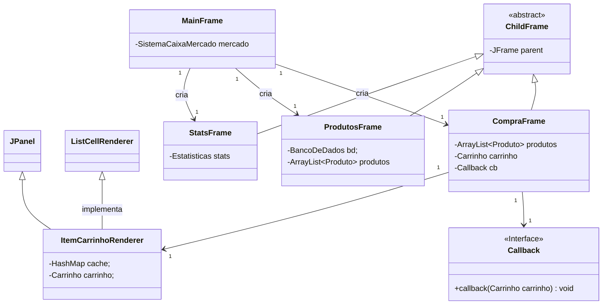

# TP1

# Diagrama de Classes (frames)

```mermaid
classDiagram

class ChildFrame {
    <<abstract>>
    -JFrame parent
}

class Callback {
    <<Interface>>
    +callback(Carrinho carrinho) void
}

class ItemCarrinhoRenderer {
    -HashMap<String, ImageIcon> cache;
    -Carrinho carrinho;
}

JPanel <|-- ItemCarrinhoRenderer
ListCellRenderer <|-- ItemCarrinhoRenderer : implementa

class CompraFrame {
    -ArrayList~Produto~ produtos
    -Carrinho carrinho
    -Callback cb
}

ChildFrame <|-- CompraFrame
CompraFrame "1" --> "1" Callback
CompraFrame "1" --> "1" ItemCarrinhoRenderer

class ProdutosFrame {
    -BancoDeDados bd;
    -ArrayList~Produto~ produtos
}

ChildFrame <|-- ProdutosFrame

class MainFrame {
    -SistemaCaixaMercado mercado
}

MainFrame "1" --> "1" CompraFrame : cria
MainFrame "1" --> "1" ProdutosFrame : cria
MainFrame "1" --> "1" StatsFrame : cria

class StatsFrame {
    -Estatisticas stats
}

ChildFrame <|-- StatsFrame

```